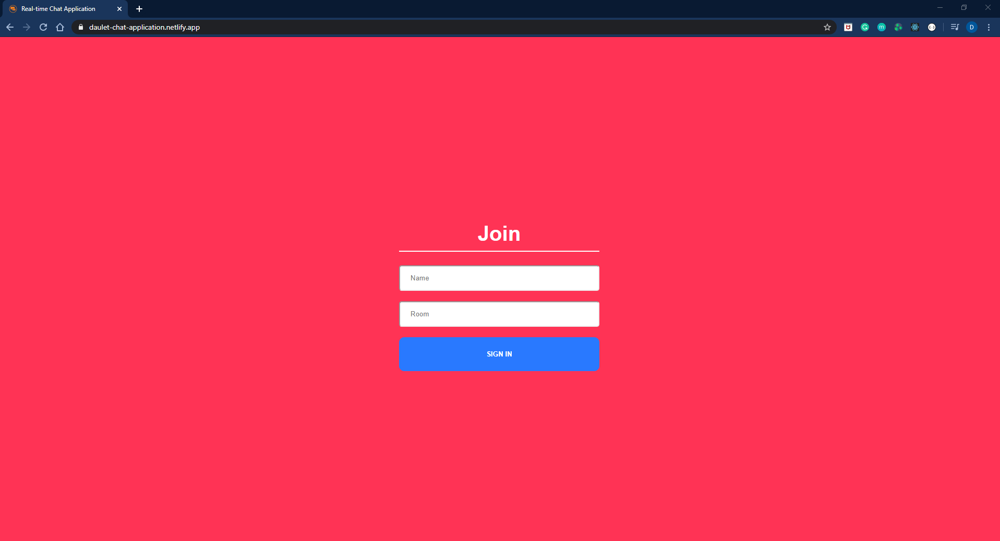
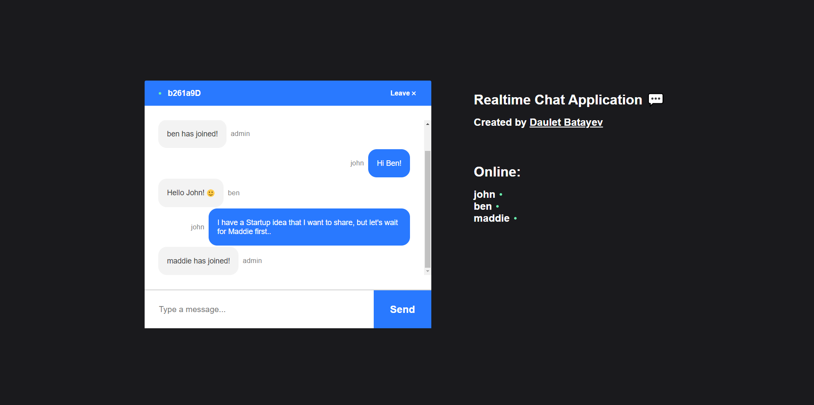
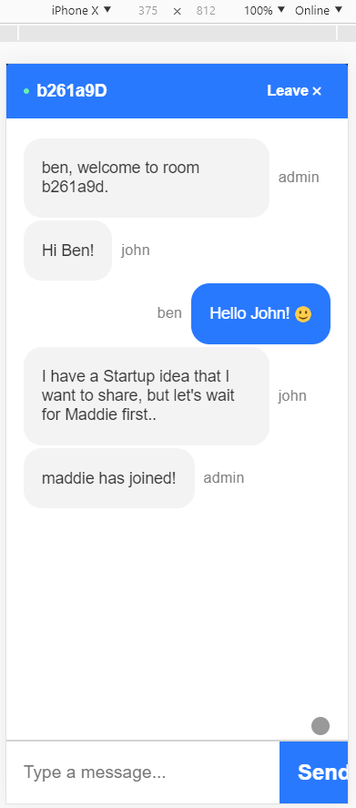

# Realtime Chat Application

## [View the Realtime Chat-Application](https://daulet-chat-application.netlify.app/)

## The App Screen Shots
### Join Menu

### Chat Body

### Mobile Responsiveness

Developed a Realtime Chat Application with **React** on the front-end, with **NodeJS**, **Express**, **Socket.io** Web Socket Library and other libraries on the back-end.

The back-end was deployed on **Heroku** and the front-end was deployed on **Netlify**.

# Setup

- Clone this repository
- Run `npm install` to install all the dependencies
- Set the client endpoint to **localhost:5000** in *client/src/components/Chat/Chat.js*
- Run `npm i && npm start`for both client and server side to start the development server

Then, you will be able to access the application at **localhost:3000**.

	© 2020 Daulet Batayev
